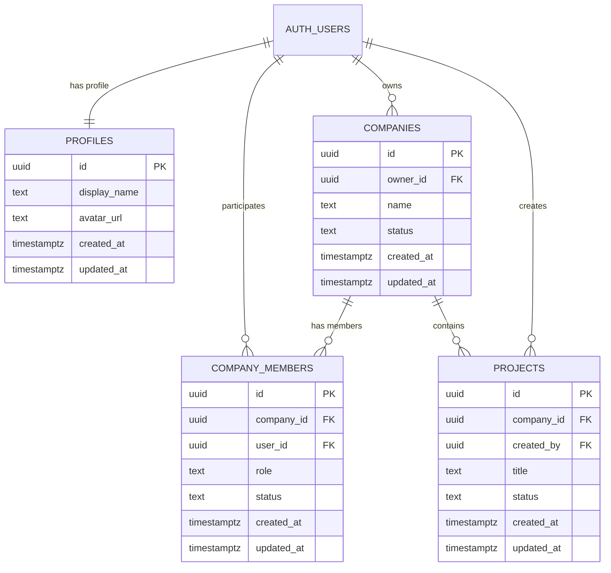

# ADR-024 — Platform Domain Foundation

**Статус:** Proposed (предложено)
**Дата:** 2026-07-24
**Владелец решения:** Platform Owner
**Release:** 0.4
**Engineering Package:** EP-024 — Platform Domain Foundation
**Базовый коммит:** `364ee1980a0a8fd4520e4dd44b52193ad3b260ea`

## 1. Контекст

В ветке `engineering/ep-023-security-recovery` подтверждено, что приложение обращается к доменным таблицам `companies`, `projects`, `tasks`, `requests`, `offers` и `ai_usage`, однако в подтверждённой TEST-схеме Supabase существуют только таблицы Billing Recovery:

- `billing_customers`;
- `billing_subscriptions`;
- `billing_webhook_events`.

История миграций GitHub и TEST синхронизирована и содержит только миграцию `202607190001_ep_023_billing_recovery.sql`. Следовательно, отсутствующая доменная схема не является неприменённой миграцией: она не была оформлена как подтверждённая платформенная основа.

Существующий сервис компаний использует `companies.owner_id` как единственный способ найти компанию пользователя. Существующий сервис проектов ожидает связи с `companies`, `requests`, `offers` и `tasks`. Такая реализация смешивает владение, членство и доступ и не может быть безопасной основой для заказчиков, исполнителей и команд.

## 2. Решение

Создать минимальное архитектурно завершённое доменное ядро из четырёх сущностей:

1. `profiles` — прикладной профиль пользователя;
2. `companies` — организация или рабочее пространство компании;
3. `company_members` — членство пользователя в компании и его роль;
4. `projects` — проект, принадлежащий компании.

Ядро проектируется как Platform Foundation (платформенная основа — устойчивый слой, на который добавляются прикладные модули) и не должно зависеть от `requests`, `offers`, `tasks`, `ai_usage`, Billing или AI.

## 3. Архитектурные инварианты

### 3.1 Идентичность пользователя

- `auth.users` является единственным источником Authentication (аутентификация — подтверждение личности пользователя).
- `profiles.id` должен ссылаться на `auth.users.id` отношением один к одному.
- `profiles` не хранит пароль, токены или данные, заменяющие Supabase Auth.

### 3.2 Компания

- `companies` является самостоятельной доменной сущностью.
- `companies.owner_id` указывает ответственного владельца компании.
- `owner_id` не является единственным механизмом Authorization (авторизация — проверка разрешённых действий).
- Владелец компании обязан иметь активное членство `company_members` с ролью `owner`.
- Передача владения должна выполняться отдельной контролируемой операцией, которая атомарно обновляет `companies.owner_id` и роли членства.

### 3.3 Членство

- Любой доступ пользователя к данным компании определяется через `company_members`.
- Одна пара `(company_id, user_id)` может иметь не более одного членства.
- Минимальные роли первой версии:
  - `owner` — владелец и окончательно ответственный пользователь;
  - `admin` — управление компанией и участниками в разрешённых границах;
  - `member` — рабочий доступ без административных полномочий.
- Минимальные состояния членства:
  - `active`;
  - `suspended`;
  - `removed`.
- Приглашения не входят в ADR-024 и должны быть добавлены отдельным решением.

### 3.4 Проект

- Каждый проект обязан принадлежать ровно одной компании через `projects.company_id`.
- `projects.owner_id` не включается в устойчивое ядро: доступ определяется членством в компании.
- Создатель проекта может храниться как `created_by`, но это поле является аудитным, а не разрешающим.
- Ссылки на `requests` и `offers` не входят в базовую таблицу `projects` ADR-024. Они добавляются последующими миграциями соответствующего модуля.
- `tasks` не входят в EP-024.

## 4. Минимальная модель данных

### 4.1 `profiles`

Обязательные поля:

- `id uuid primary key references auth.users(id) on delete cascade`;
- `display_name text null`;
- `avatar_url text null`;
- `created_at timestamptz not null`;
- `updated_at timestamptz not null`.

Профиль создаётся автоматически или контролируемой серверной операцией. Пользователь может читать и изменять только собственный профиль, кроме будущих явно публичных полей.

### 4.2 `companies`

Обязательные поля:

- `id uuid primary key`;
- `owner_id uuid not null references auth.users(id)`;
- `name text not null`;
- `description text null`;
- `phone text null`;
- `email text null`;
- `city text null`;
- `status company_status not null default 'draft'`;
- `created_at timestamptz not null`;
- `updated_at timestamptz not null`.

Состояния компании:

- `draft`;
- `active`;
- `suspended`;
- `archived`.

Удаление компании в первой версии выполняется логически через `archived`, а не физическим `DELETE`.

### 4.3 `company_members`

Обязательные поля:

- `id uuid primary key`;
- `company_id uuid not null references companies(id) on delete cascade`;
- `user_id uuid not null references auth.users(id) on delete cascade`;
- `role company_member_role not null`;
- `status company_member_status not null default 'active'`;
- `created_at timestamptz not null`;
- `updated_at timestamptz not null`;
- `unique(company_id, user_id)`.

### 4.4 `projects`

Обязательные поля:

- `id uuid primary key`;
- `company_id uuid not null references companies(id)`;
- `created_by uuid not null references auth.users(id)`;
- `title text not null`;
- `description text null`;
- `status project_status not null default 'draft'`;
- `created_at timestamptz not null`;
- `updated_at timestamptz not null`.

Состояния проекта первой версии:

- `draft`;
- `active`;
- `completed`;
- `cancelled`;
- `archived`.

Существующие состояния `published` и `in_progress` требуют отдельного продуктового обоснования. До такого решения они не включаются в фундаментальную модель.

## 5. ERD

ERD (Entity Relationship Diagram — диаграмма связей сущностей):

## 6. RLS-стратегия

RLS (Row Level Security — безопасность на уровне строк) включается и принудительно применяется для всех четырёх таблиц.

### 6.1 Общие правила

- Анонимный пользователь не получает доступ к доменным таблицам.
- Пользователь видит только компании, в которых имеет активное членство.
- Пользователь видит только проекты компаний, в которых имеет активное членство.
- `owner` и `admin` могут изменять данные компании в разрешённых границах.
- `member` не может изменять компанию или состав участников.
- Окончательные юридически, финансово и безопасностно значимые действия остаются за Platform Owner или явно уполномоченным человеком.

### 6.2 Вспомогательные функции доступа

Допускаются стабильные SQL-функции:

- `is_company_member(company_id uuid)`;
- `has_company_role(company_id uuid, allowed_roles company_member_role[])`;
- `can_access_project(project_id uuid)`.

Требования к функциям:

- фиксированный безопасный `search_path`;
- минимальные привилегии;
- отсутствие динамического SQL;
- отсутствие обхода RLS без документированной необходимости;
- тестирование положительных и отрицательных сценариев.

### 6.3 Защита от рекурсии RLS

Политики `companies` и `company_members` не должны создавать циклические обращения друг к другу. Конкретная реализация функций доступа должна пройти отдельный Security Review (проверка безопасности — анализ возможности обхода прав) до применения миграции.

## 7. Жизненные циклы

### 7.1 Создание компании

Одна серверная транзакция должна:

1. создать `companies`;
2. создать `company_members` для создателя с ролью `owner` и статусом `active`;
3. завершиться целиком или полностью откатиться.

Прямое клиентское создание компании без гарантированного создания членства не допускается.

### 7.2 Архивация компании

- Физическое удаление компании обычным пользователем запрещено.
- Статус меняется на `archived`.
- Архивная компания недоступна для создания новых проектов и операций изменения.

### 7.3 Создание проекта

- Пользователь должен иметь активное членство компании.
- Минимально допустимые роли для создания проекта определяются Capability проекта; до отдельного решения предлагаются `owner` и `admin`.
- `created_by` заполняется из подтверждённого `auth.uid()`, а не из клиентского ввода.

## 8. Влияние на заказчика и исполнителя

### Заказчик

- видит только свои организации и проекты;
- не сталкивается с внутренними ролями и техническими политиками, если действие разрешено;
- получает понятное сообщение при отсутствии доступа;
- не может случайно создать проект вне компании.

### Исполнитель

- доступ предоставляется через явное членство или будущий модуль участия в проекте;
- один пользователь может участвовать в нескольких компаниях без дублирования учётной записи;
- дальнейшее добавление `project_members` не требует изменения базовых таблиц.

## 9. Не входит в ADR-024

- приглашения и принятие приглашений;
- `project_members`;
- `requests`;
- `offers`;
- `tasks`;
- `ai_usage`;
- Billing-связь с компаниями;
- аудит событий;
- публичные каталоги компаний;
- сложная матрица разрешений;
- юридическая верификация компаний.

Каждый такой модуль должен расширять ядро отдельной миграцией и не менять его фундаментальные связи.

## 10. Миграционная стратегия

EP-024 реализуется одной атомарной миграцией платформенного ядра либо небольшим последовательным набором миграций, применяемых в одном инженерном пакете.

Обязательные свойства:

- повторяемость в чистой TEST-среде;
- отсутствие ручного создания таблиц через Dashboard;
- согласованная Migration history (история миграций — перечень применённых изменений базы);
- отсутствие изменений Production до отдельного утверждения;
- документированный rollback plan (план отката — способ безопасно отменить изменение до появления пользовательских данных).

## 11. Изменения сервисного слоя

После появления схемы:

- `getCurrentUserCompany()` заменяется на получение доступных компаний через `company_members`;
- `createCompany()` переносится на безопасную серверную транзакцию;
- `listCompanies()` полагается на RLS, но не заменяет им проверку бизнес-прав;
- `Project.owner_id` удаляется из устойчивого контракта;
- `request_id` и `accepted_offer_id` удаляются из базового `Project` и возвращаются только вместе с соответствующими модулями;
- страницы продолжают работать только через `services/...`.

## 12. Риски

1. **RLS recursion (рекурсия RLS — взаимный вызов политик таблиц)**. Снижается отдельными функциями доступа и тестами.
2. **Несогласованность владельца и членства**. Снижается транзакционным созданием и передачей владения.
3. **Слишком широкая роль admin**. Разрешения первой версии должны быть минимальными.
4. **Несовместимость старого TypeScript-контракта**. Исправляется одновременно со схемой и проверяется TypeScript.
5. **Расширение EP-024 прикладными модулями**. Запрещается разделом «Не входит».

## 13. Альтернативы

### Использовать только `owner_id`

Отклонено: не поддерживает команды, исполнителей и безопасную передачу доступа.

### Создать сразу все ожидаемые таблицы

Отклонено: переносит неподтверждённые продуктовые решения в фундамент и повышает риск переделки.

### Использовать универсальную таблицу разрешений

Отклонено для Release 0.4: создаёт лишнюю сложность до появления подтверждённых сценариев.

## 14. Architecture Readiness Check

Перед Implementation (реализация — внесение изменений в код и базу) должны быть подтверждены:

- соответствие Release 0.4;
- связь с Capability компаний и проектов;
- отсутствие зависимости ядра от `requests`, `offers`, `tasks`, AI и Billing;
- RLS-модель без циклических политик;
- сценарии заказчика и исполнителя;
- транзакционное создание компании и владельца;
- миграционный и проверочный план;
- обновление типов и сервисов;
- критерии завершения.

## 15. Критерии завершения EP-024

- ADR-024 принят Platform Owner;
- миграция существует в GitHub;
- миграция успешно применяется в чистой TEST-среде;
- в TEST созданы только утверждённые сущности ядра;
- RLS включена и проверена для всех таблиц;
- отрицательные тесты подтверждают запрет чужого доступа;
- создание компании атомарно создаёт членство владельца;
- сервисы компаний и проектов соответствуют новой модели;
- Lint (проверка качества кода) проходит;
- TypeScript (статическая проверка типов) проходит;
- Production Build (промышленная сборка) проходит;
- Diff Check (проверка различий) не содержит посторонних изменений;
- Migration Check (проверка миграций) подтверждает синхронизацию GitHub и TEST;
- инженерная документация обновлена;
- Production не изменён без отдельного утверждения.

## 16. Последствия

### Положительные

- доступ отделён от владения;
- компании поддерживают команды;
- проекты имеют устойчивую принадлежность;
- будущие модули добавляются расширением;
- RLS проектируется до появления пользовательских данных.

### Отрицательные

- существующие сервисы и типы потребуют изменения;
- создание компании нельзя оставлять простым клиентским `insert`;
- потребуется отдельный набор SQL-тестов доступа.

## 17. Следующий шаг

После принятия ADR-024 подготовить EP-024 Engineering Package (инженерный пакет — документ реализации и проверок), точную SQL-спецификацию и матрицу RLS до создания миграции.
