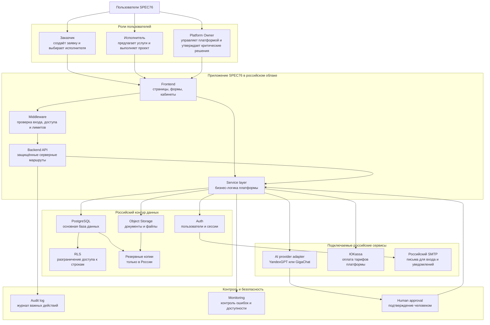
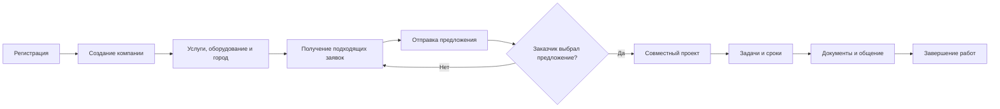
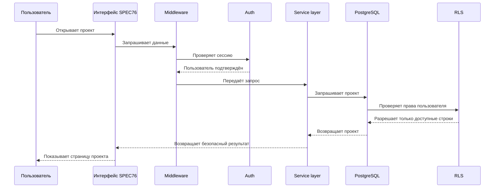
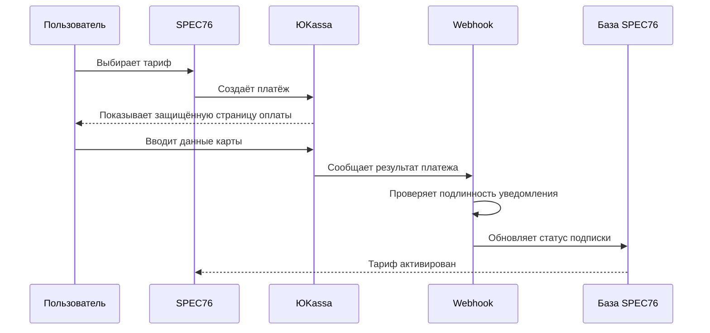

# Общая структура платформы — диалог с ChatGPT (оригинал)

- Document ID (идентификатор документа): SPEC76-FOUNDATIONAL-PLATFORM-ARCHITECTURE-CHAT
- Version (версия): 1.0 (оригинальный текст)
- Status (статус): Historical Source Document (исторический первоисточник)
- Date (дата): переписка датирована 10 августа (год не указан в источнике, контекстно — 2026); добавлено в репозиторий 2026-10-03
- Owner (владелец): Platform Owner
- Origin (происхождение): файл `Общая структура платформы.pages`, обнаружен на `~/Desktop/Спец76/`, никогда ранее не был закоммичен в GitHub

## Зачем этот документ важен

В отличие от `TZ_SPEC76_ORIGINAL.md`/`PRD_SPEC76_ORIGINAL.md` (бизнес-требования), это **техническое архитектурное обсуждение** — ближе по духу к `ADR-025`/`ADR-026`, но подробнее и предметнее: с диаграммами (mermaid), деревом кода, конкретным пайплайном безопасности ИИ и разделом "что уже есть / чего нет", который почти дословно совпадает по структуре с нынешними блокерами в `CURRENT_SPRINT.md`.

**Новое, чего не было ни в одном уже закоммиченном документе**:
- Концепция **Bot Gateway** — единый шлюз, объединяющий MAX/Telegram/VK/сайт как разные "входы" в одну платформу, а не отдельные версии продукта. Бот может объяснить возможности, определить роль пользователя, создать предварительную заявку, уведомить, дать deep link — но не может провести сделку, показать документы или подтвердить платёж (это остаётся в защищённом интерфейсе).
- Более полный состав кабинета владельца платформы: Пользователи, Компании, Заявки и проекты, **Жалобы и спорные ситуации**, Использование ИИ, Лимиты и расходы, Платежи и тарифы, Журнал важных действий, Состояние системы, Настройки безопасности — заметно шире, чем то, что сейчас реализовано в `app/admin/page.tsx` (OP-024).
- Явное требование отдельной **Platform Admin Model**, не смешанной с ролью `admin` внутри компании — сейчас `platform_roles` (OP-032) и `company_members.role` действительно разделены, это соответствует.
- Подтверждение выбора российских провайдеров ИИ: **YandexGPT или GigaChat** — не названы явно ни в `ADR-026`, ни где-либо ещё в репозитории до этого момента.

## Полный текст

Да. После полной готовности SPEC76 будет выглядеть как единая рабочая платформа, но внутри состоять из нескольких защищённых слоёв. Пользователь этой сложности видеть не будет.

Важно: схема ниже — целевая архитектура. Часть уже реализована, часть ещё предстоит построить.

### 1. Общая структура платформы



Главная идея: пользователь работает с простым интерфейсом, а авторизация, безопасность, база, ИИ и платежи скрыты внутри.

### 2. Как работает заказчик

```mermaid
flowchart LR
    A["Вход по email"] --> B["Создание заявки"]
    B --> C["ИИ анализирует описание"]
    C --> D["Заказчик проверяет результат"]
    D --> E["Платформа подбирает исполнителей"]
    E --> F["Исполнители отправляют предложения"]
    F --> G["Заказчик выбирает предложение"]
    G --> H["Создаётся проект"]
    H --> I["Задачи, сроки, документы и сообщения"]
    I --> J["Завершение проекта"]
```



Заказчик увидит примерно такое меню:

```
SPEC76
├── Главная
├── Мои заявки
│   ├── Новая заявка
│   ├── Анализ заявки
│   └── Предложения исполнителей
├── Мои проекты
│   ├── Обзор
│   ├── Задачи
│   ├── Календарный план
│   ├── Документы
│   └── Сообщения
├── Уведомления
├── Тариф и оплата
└── Профиль
```

ИИ не сможет самостоятельно выбрать исполнителя, принять договор или подтвердить финансовое действие. Он только анализирует и рекомендует.

### 3. Как работает исполнитель



Интерфейс исполнителя:

```
SPEC76 для исполнителя
├── Моя компания
│   ├── Основная информация
│   ├── Услуги
│   └── Оборудование
├── Подходящие заявки
├── Мои предложения
├── Активные проекты
│   ├── Задачи
│   ├── Сроки
│   ├── Документы
│   └── Сообщения
├── Уведомления
└── Профиль
```

### 4. Кабинет владельца платформы

Такого полноценного кабинета пока нет. После реализации он должен быть отдельным защищённым контуром:

```
Управление SPEC76
├── Пользователи
├── Компании
├── Заявки и проекты
├── Жалобы и спорные ситуации
├── Использование ИИ
├── Лимиты и расходы
├── Платежи и тарифы
├── Журнал важных действий
├── Состояние системы
└── Настройки безопасности
```

Здесь потребуется отдельная Platform Admin Model (модель администратора платформы). Она не должна смешиваться с ролью `admin` внутри компании.

### 5. Что происходит при каждом запросе

Например, пользователь открывает проект:



Таким образом, даже если пользователь вручную подставит идентификатор чужого проекта, RLS (защита строк базы) не позволит получить его данные.

### 6. Как будет работать ИИ

```mermaid
flowchart LR
    REQUEST["Запрос пользователя"] --> ACCESS["Проверка проекта и пользователя"]
    ACCESS --> LIMIT["Проверка лимита"]
    LIMIT --> CLEAN["Удаление персональных и лишних данных"]
    CLEAN --> PROVIDER["Российский поставщик ИИ"]
    PROVIDER --> VALIDATE["Проверка структуры ответа"]
    VALIDATE --> SAVE["Сохранение результата"]
    SAVE --> HUMAN["Проверка человеком"]
    HUMAN --> DECISION["Окончательное решение"]
```



Защита ИИ будет состоять из нескольких правил:

1. ИИ получает только необходимые данные.
2. Персональные данные по умолчанию не отправляются.
3. Каждый запрос учитывается в `ai_usage`.
4. Действует ограничение 10 запросов за 60 секунд.
5. Ответ проверяется перед показом пользователю.
6. Юридические, финансовые и критические действия подтверждает человек.
7. ИИ не может самостоятельно менять production code (рабочий код) или базу.

> Примечание 2026-10-03: пункты 3–4 уже реализованы (`SPEC76-EP-023` AI Usage Lifecycle, решение Platform Owner от 2026-08-10, `engineering/decisions/DECISION_LOG.md`) — технический rate limit 10 запросов/60 секунд на пользователя подтверждён в коде.

### 7. Как будет работать оплата



SPEC76 не должен получать номер карты, CVC-код или другие полные платёжные реквизиты. Их обрабатывает ЮKassa. В нашей базе остаются только идентификатор платежа, тариф, статус и даты.

### 8. Внутренняя структура исходного кода

```
spec76-core/
│
├── app/                      Пользовательский интерфейс
│   ├── auth/                 Вход
│   ├── companies/            Компании исполнителей
│   ├── requests/             Заявки заказчиков
│   ├── projects/             Рабочее пространство проекта
│   │   └── [id]/
│   │       ├── tasks/            Задачи
│   │       ├── timeline/         Сроки и этапы
│   │       ├── docs/             Документы
│   │       ├── communication/    Сообщения
│   │       ├── notifications/    Уведомления
│   │       └── governance/       Управление решениями
│   └── api/                  Серверные маршруты
│       ├── ai/                ИИ
│       ├── billing/           Платежи
│       └── health/            Проверка работоспособности
│
├── services/                 Бизнес-логика
│   ├── auth.ts                Вход пользователя
│   ├── companies.ts           Компании
│   ├── requests.ts            Заявки
│   ├── contractorMatching.ts  Подбор исполнителей
│   ├── offers.ts              Предложения
│   ├── projects.ts            Проекты
│   ├── tasks.ts                Задачи
│   ├── timeline.ts             Сроки
│   ├── documents.ts            Документы
│   ├── conversations.ts        Диалоги
│   ├── messages.ts             Сообщения
│   ├── notifications.ts        Уведомления
│   └── usageBilling.ts         Лимиты и учёт ИИ
│
├── lib/                      Инфраструктурные компоненты
│   ├── supabase/               Подключение к базе
│   ├── billing/                Платёжный поставщик
│   └── kanban/                 Логика доски задач
│
├── types/                    Описание объектов TypeScript
│   ├── user.ts                 Пользователь
│   ├── company.ts               Компания
│   ├── request.ts               Заявка
│   ├── offer.ts                 Предложение
│   ├── project.ts               Проект
│   ├── task.ts                  Задача
│   └── document.ts              Документ
│
├── database/migrations/      Основные таблицы продукта
├── supabase/migrations/      Production-миграции и безопасность
├── engineering/               Архитектурные решения и отчёты
├── middleware.ts               Защита входа в API
└── archive/legacy/             Старый код, не участвующий в работе
```

Можно запомнить простую последовательность: `app → services → lib → database`.

- `app` — что видит пользователь;
- `services` — что должна сделать платформа;
- `lib` — как подключиться к техническому сервису;
- `database` — где безопасно хранится результат.

### 9. Что уже есть и чего пока нет (на момент переписки, 10 августа)

**Уже реализовано:**
- вход через Supabase Auth;
- компании и роли `owner`, `admin`, `member`;
- заявки, анализ, подбор исполнителей и предложения;
- проекты, задачи, сроки, документы, сообщения и уведомления;
- RLS (защита строк);
- защита API;
- учёт и ограничение запросов ИИ;
- защищённая обработка платёжных уведомлений;
- инженерная документация и миграции.

**Ещё предстоит:**
- российский production-контур;
- перенос Auth, базы, файлов, логов и резервных копий в РФ;
- полноценное разделение интерфейсов заказчика и исполнителя;
- глобальная роль администратора платформы;
- российская платёжная интеграция;
- российский поставщик ИИ;
- удаление персональных данных перед отправкой в ИИ;
- политика конфиденциальности, согласия и юридические документы;
- мониторинг, резервное восстановление и план аварийного переключения;
- полноценное тестирование пользовательского пути.

> Примечание 2026-10-03: почти все пункты списка "ещё предстоит" совпадают по смыслу с текущими блокерами в `engineering/sprints/CURRENT_SPRINT.md` и `ADR-026` — то есть за прошедшее время (с 10 августа) список целей не изменился, большая часть пунктов по-прежнему актуальна.

Главная мысль: мы не начинаем заново. Уже построен основной «скелет» SPEC76. Теперь его нужно перенести в российский защищённый контур, завершить интерфейсы и подключить российских поставщиков.

---

### Продолжение диалога (10 авг., 23:02 и 23:20)

**Вопрос Platform Owner (10 авг., 23:02):**

> Я в схеме не вижу предусмотренных ранее чат ботов, меседжеров МАХ, телеграм ВК, план развития и привлечения людей к работе в нашем проекте. Или это отдельно будет реализовано? А может выдать интерфейс пользователя и заказчика. или как будет выглядить примерно по твоей задумке?

**Ответ (10 авг., 23:20):**

Ты прав: мессенджеры и привлечение пользователей — важный внешний слой SPEC76. В предыдущей схеме было показано только внутреннее ядро.

Фактически на тот момент:
- внутренний чат проекта уже существует;
- Telegram и MAX зафиксированы в документации как будущие каналы уведомлений, но ещё не реализованы;
- Growth Agent (агент развития, см. `ADR-025`) описан архитектурно, но пока не подключён;
- VK, чат-боты и единая воронка привлечения ещё не спроектированы официально.

**Как это должно работать:**

```
MAX ───────┐
Telegram ──┼─→ Bot Gateway (шлюз чат-ботов) ─→ SPEC76
VK ────────┤
Сайт ──────┘
```

Бот сможет:
- объяснить возможности SPEC76;
- определить, кто пришёл: заказчик или исполнитель;
- задать несколько простых вопросов;
- создать предварительную заявку;
- уведомить о предложении, сообщении или сроке;
- дать deep link (прямую ссылку) на нужный экран SPEC76.

Но договоры, документы, платежи, выбор исполнителя и критические подтверждения останутся внутри защищённого интерфейса SPEC76.
